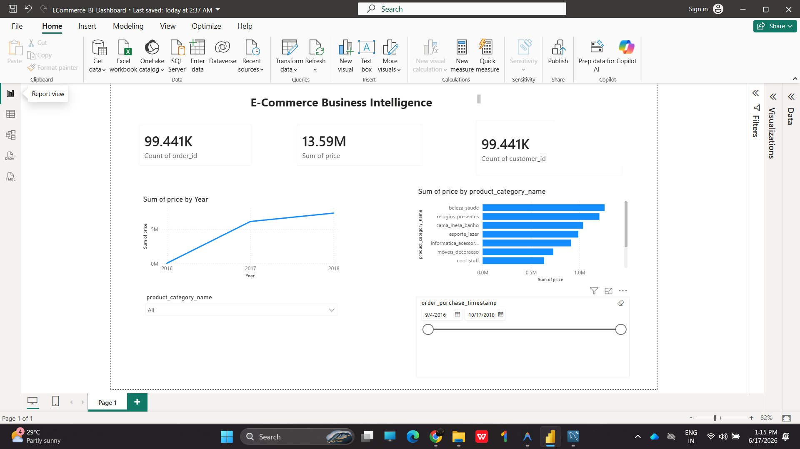
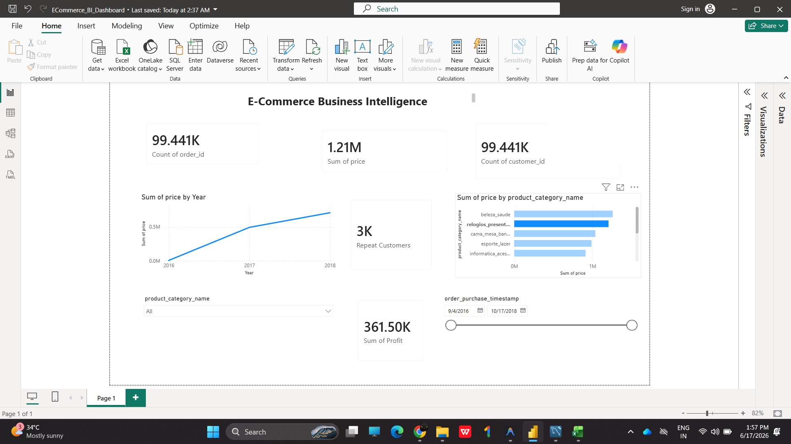
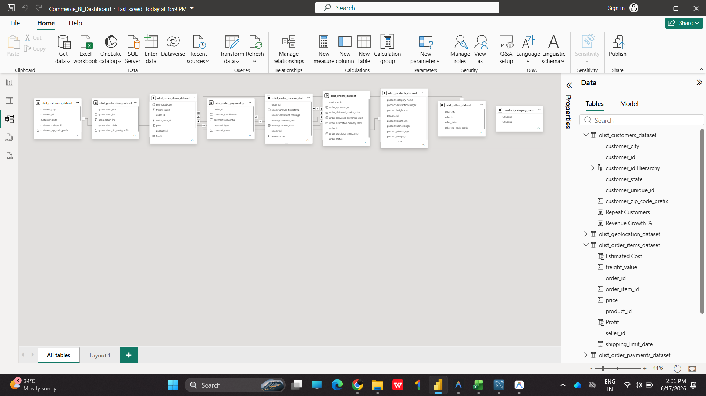

<h1 align="center">🛍️ E-Commerce Business Intelligence Platform</h1>

<p align="center">
  <strong>An end-to-end data analytics and business intelligence solution designed to extract, model, and visualize transactional e-commerce data for strategic decision-making.</strong>
</p>

<p align="center">
  <a href="https://github.com/Dinil007/ECommerce-Business-Intelligence-Platform">
    
  </a>
  <a href="https://github.com/Dinil007/ECommerce-Business-Intelligence-Platform">
    
  </a>
  <a href="https://github.com/Dinil007/ECommerce-Business-Intelligence-Platform">
    
  </a>
  <a href="https://github.com/Dinil007/ECommerce-Business-Intelligence-Platform">
    
  </a>
</p>

---

## 📌 Overview

This repository hosts a comprehensive **E-Commerce Business Intelligence Platform** built to analyze complex retail datasets (based on the Brazilian Olist E-Commerce dataset). The project bridges the gap between raw transactional databases and executive-level decision making. By leveraging a relational SQL database for advanced data analysis and Microsoft Power BI for dynamic interactive dashboarding, this platform delivers deep operational insights into customer distribution, revenue growth patterns, sales health, and shipping cost efficiency.

---

## 🚀 Features

* **Advanced Relational Modeling:** Normalization of customers, products, orders, and order items.
* **Interactive Executive Dashboard:** Fully dynamic charts, filters, and slicers (by date range and product categories) built in Power BI.
* **Comprehensive Sales & Order Tracking:** Monitors daily, weekly, and monthly growth trends.
* **Logistics & Freight Analysis:** Correlates shipping expenses and product weights to optimize supply chain cost structures.
* **Customer Demographics Profiling:** Maps and tracks customer acquisition volumes across regional locations.
* **Optimized SQL Queries:** High-performance analytical queries to extract direct business metrics from raw database instances.

---

## 🛠️ Tech Stack

| Technology | Purpose | Key Capabilities |
| :--- | :--- | :--- |
| **SQL (MySQL)** | Database Engine & Analytics | Schema design, table creation, joins, aggregations, performance optimization |
| **Microsoft Power BI** | Business Intelligence & Visualization | Interactive dashboard design, data modeling, DAX measures, custom filters |
| **Microsoft Excel** | Data Pre-processing | Data inspection, cleaning, and preliminary format verification |
| **Markdown** | Documentation | Structured repository navigation and professional presentation |

---

## 📊 Dashboard KPIs

The BI dashboard tracks and displays five critical business performance indicators:
1. **Total Revenue:** Gross sales generated from product purchases.
2. **Total Orders:** Cumulative volume of completed customer orders.
3. **Total Customers:** Unique purchasing clients, reflecting client base expansion.
4. **Average Order Value (AOV):** The mean monetary amount spent per transaction, identifying customer purchasing power.
5. **Freight Cost Ratio:** Total shipping fees analyzed to optimize carrier negotiations and regional pricing strategies.

---

## 📁 Project Structure

```text
ECommerce-BI/
├── PowerBI/
│   └── ECommerce_BI_Dashboard.pbix         # Main interactive Power BI dashboard
├── Screenshots/
│   ├── dashboard1.png                      # Dashboard view 1
│   ├── dashboard2.png                      # Dashboard view 2
│   ├── dashboard3.png                      # Supplemental dashboard view 3
│   └── image.png                           # Main dashboard visual overview
├── data/
│   ├── olist_customers_dataset.csv         # Customer geographic and unique ID data
│   ├── olist_geolocation_dataset.csv       # Geographic prefixes and coordinate mapping
│   ├── olist_order_items_dataset.csv       # Individual order lines, pricing, and freight values
│   ├── olist_order_payments_dataset.csv    # Payment methods and installment information
│   ├── olist_order_reviews_dataset.csv     # Customer satisfaction and review scores
│   ├── olist_orders_dataset.csv            # Order status logs and timestamps
│   ├── olist_products_dataset.csv          # Product dimensions and category assignments
│   ├── olist_sellers_dataset.csv           # Seller geographic and registry data
│   └── product_category_name_translation.csv # Category translations (Portuguese to English)
├── sql/
│   ├── schema.sql                          # Relational database schema structure DDL
│   └── analysis_queries.sql                # Production SQL queries for business analytics
├── .gitignore                              # Git exclusion file
├── olist_orders_cleaned.xlsx               # Staged and cleaned dataset in Excel format
└── README.md                               # Project documentation (this file)
```

---

## 💻 SQL Analysis

Here are some of the primary SQL analytics queries utilized in this project (available in [`sql/analysis_queries.sql`](file:///d:/ECommerce-BI/sql/analysis_queries.sql)):

### 1. Revenue & Order Performance Metrics
```sql
-- Total Revenue
SELECT SUM(price) AS Total_Revenue
FROM order_items;

-- Total Orders
SELECT COUNT(DISTINCT order_id) AS Total_Orders
FROM orders;

-- Average Order Value (AOV)
SELECT AVG(price) AS Average_Order_Value
FROM order_items;
```

### 2. Top-Performing Product Categories
```sql
-- Top 10 Product Categories by Revenue
SELECT
    p.product_category_name,
    SUM(oi.price) AS Revenue
FROM order_items oi
JOIN products p ON oi.product_id = p.product_id
GROUP BY p.product_category_name
ORDER BY Revenue DESC
LIMIT 10;
```

### 3. Freight Cost Assessment
```sql
-- Total Freight Cost
SELECT SUM(freight_value) AS Total_Freight_Cost
FROM order_items;
```

---

## 📸 Dashboard Preview

<p align="center">
  
  
</p>
<p align="center">
  
</p>

---

## 💡 Business Insights

* **Inventory Optimization:** By identifying the top 10 product categories by revenue, supply chain managers can optimize inventory turnover rates, ensuring popular items are always in stock.
* **Pricing & Shipping Decisions:** Analyzing freight costs against purchase price helps management structure promotional campaigns (such as free shipping thresholds) without eroding profitability.
* **Customer Retention & Targeting:** Identifying geographical customer distribution assists marketing teams in designing regional and localized advertising campaigns.
* **AOV Growth Strategy:** Tracking the Average Order Value enables the implementation of cross-selling and up-selling strategies to maximize revenue per check-out.

---

## 🔮 Future Enhancements

* **ETL Pipeline Automation:** Implement an automated ETL pipeline using Python (`pandas`, `SQLAlchemy`) and Apache Airflow to regularly refresh data.
* **Predictive Analytics:** Train machine learning models (e.g., customer churn predictors and sales forecasting engines) and embed the results directly in Power BI.
* **Real-time Streaming:** Connect the dashboard to active cloud data lakes (e.g., AWS S3 or Snowflake) to display live transactional data.
* **Advanced Customer Segmentation:** Implement RFM (Recency, Frequency, Monetary) segmentation using SQL/DAX for targeted retention marketing.

---

## ▶️ How to Run

### Prerequisite Setup
1. Download and install **Power BI Desktop**.
2. Set up a local SQL database instance (MySQL or similar relational engine).

### Database Initialization
1. Execute the schema generation script located at [`sql/schema.sql`](file:///d:/ECommerce-BI/sql/schema.sql) on your SQL server to construct the database container and relational tables.
2. Load the cleaned data CSV files from the `data/` directory into their respective database tables.

### Interactive Analysis
1. Open [`PowerBI/ECommerce_BI_Dashboard.pbix`](file:///d:/ECommerce-BI/PowerBI/ECommerce_BI_Dashboard.pbix) in Power BI Desktop.
2. If prompted, modify the data source credentials to match your local SQL database connection.
3. Click **Refresh** to import the latest database records and interact with the visuals.

---

## 👤 Author

**Dinil Raj**
* GitHub: [@Dinil007](https://github.com/Dinil007)
* LinkedIn: [Dinil Raj](https://www.linkedin.com/in/dinil-raj/)

---

## 📝 Conclusion

The **E-Commerce Business Intelligence Platform** successfully turns raw, distributed operational datasets into a highly cohesive, strategic analytical asset. By applying structured SQL schemas and querying workflows, it establishes a reliable single source of truth for corporate metrics. The final Power BI dashboard converts this consolidated data into digestible, interactive visualizations, empowering retail executives to optimize freight costs, target high-value product segments, and execute data-driven customer acquisition strategies.
